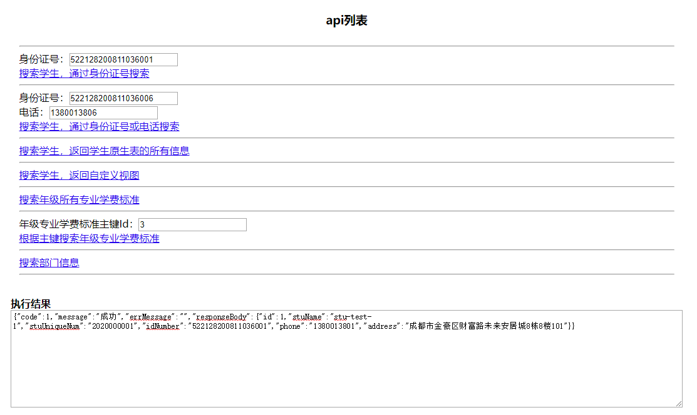

# mybatis-plugin-shard
- 基于spring 切面（AOP）实现动态多数据源切换。
- 基于 MyBatis 插件方式实现动态分表查询。
- 来源于多个已上线项目实践。
- 本项目有完整的测试示例。

以后会出详细的文档，敬请期待。

# todo
- [ ] 完善分表逻辑
- [ ] 将分表需要的参数添加到插件属性而不是配置文件
- [ ] 完善文档

# 项目地址
- github: https://github.com/uncleAndyChen/mybatis-plugin-shard
- gitee:  https://gitee.com/uncleAndyChen/mybatis-plugin-shard

# 技术清单
- JDK 1.8，理论上支持 1.8 以上的版本，如需升级，比如要改为 JDK 11，将文件 `./dependencies/pom.xml` 中 `<java.version>1.8</java.version>` 改为 `<java.version>11</java.version>`
- MySQL 5.6.46、MySQL 5.7，用这两个版本作的测试，理论上支持 5.6 及以上版本。

- maven 依赖库
maven 依赖版本在 `./dependencies/pom.xml` 维护，如果要升级某一框架的版本，只需要修改这个文件就行，这个文件被作为其它 module 的 parent 依赖项。

以下依赖为当前（2020-01-06）最新版本。
- Spring Boot 2.2.2.RELEASE
- Spring Framework 5.2.2.RELEASE （common-shard 模块直接依赖了 spring framework 下的 spring-aspects）
- MyBatis 3.5.3
- druid 1.1.21
- lombok 1.18.10
- jackson 2.10.1

# 功能详述
- 分库：简单的分库功能，更确切的讲，是多数据源管理，可根据业务动态切换，基于切面（AOP）。
- 分表：对于同一数据源或不同数据源下的，相同表结构的表，通过简单配置，实现分表查询功能。
    - 适用数据量增加迅速的业务场景。
    - 底层实现：基于 MyBatis 插件，拦截最终执行的 SQL 语句并且根据分表配置对 SQL 语句中的表名进行修改之后再执行。

# 动态切换数据源的三种方式
- 通过参数指定：优先级最高，也最灵活。
    - 可以根据具体业务场景决定要连接哪个数据源，无论是分表还是分库都可以灵活应对。
- 注解
    - 方法注解，优先级高于类注解。
    - 类注解。
- dal service 配置
    - 以上两种方式均没有的情况下，会读取配置信息。
    - 事先在配置文件 db-shard.properties 中配置好 biz.service.{schema key} 对应的服务类接口，在运行过程中，通过 AOP 拦截 biz.service，从而识别应该使用哪个数据源，达到分库/多数据源动态切换的目的。
    - 这种方式的优点：可以由专人统一管理，同时生产环境与开发、测试环境可以用不同的配置信息，开发人员与测试人员不用关注分库的细节。

如果以上三种方式都没有找到数据源，则使用默认的数据源。

# 运行
- `git clone https://github.com/uncleAndyChen/mybatis-plugin-shard.git`
- 因为依赖统一管理，添加了一个父模块：dependencies，只有一个 pom.xml 文件，需要先把这个 model 安装到本地仓库，否则会去 maven 配置的仓库下载。打开 cmd 窗口，在项目根目录下操作：
```
cd dependencies
mvn clean
mvn compile
mvn install
```
- 强烈建议：maven 远程仓库添加阿里云镜像。
    - 修改 maven 根目录下 `config/settings.xml`，在 `<mirrors>` 下添加：
```
<mirror> 
    <id>alimaven</id> 
    <name>aliyun maven</name> 
    <url>https://maven.aliyun.com/repository/jcenter</url> 
    <mirrorOf>central</mirrorOf> 
</mirror>
```
- 用你喜欢的 IDE 导入项目，如果你要我推荐一款 IDE，那么我强烈推荐 IntelliJ IDEA，官网：http://www.jetbrains.com/
- IDE 安装 Lombok 插件。
- MySQL 数据库，导入 `docs/schemas.sql`
- 修改 `biz/biz-config/src/main/resources/jdbc.properties` 中连接数据库的参数
- 启动
- 访问：`http://localhost:81/api`，可以测试以三种不同方式切换数据源来查询数据。具体细节请看源代码，以后会出详细的文档，敬请期待。


# 重新生成 mapper 和 entity
请参考 [docs/README.md](./docs/README.md)

# 有关 {xxx}Mapper.xml 文件
我是直接把 MBG 生成的 {xxx}Mapper.xml 文件放到了 biz-service-dal 模块下与 {xxx}Mapper.java 平级的目录下了，比如：biz.mapper.xml.original

默认情况下，xml 文件不会被打包，所以，运行的时候会出现这样的错误：
```
Invalid bound statement (not found): biz.service.dal.mapper.original.EduStudentMapper.selectByExample
```

需要在 pom.xml 里设置为需要将 xml 一起打包，如下：
```
<build>
    <resources>
        <resource>
            <directory>src/main/java</directory>
            <includes>
                <include>**/*.xml</include>
            </includes>
            <filtering>false</filtering>
        </resource>
    </resources>
</build>
```
> directory 配置到 xml 的父目录 `src/main/java/biz/mapper/xml` 不会生效，配置成 `src/main/java` 就好。
